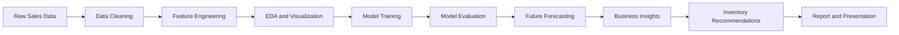
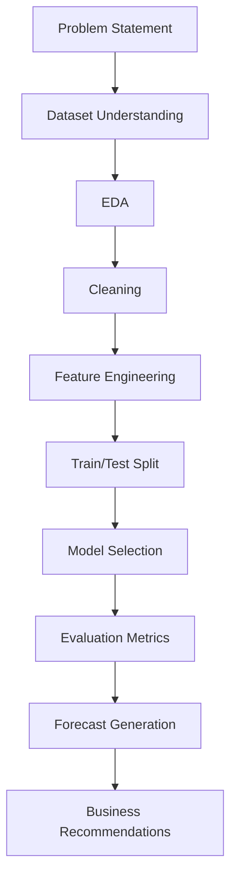

# Retail Sales Forecasting using Machine Learning

<p align="center">
	
</p>

<p align="center">
	
	
	
	
	
</p>

## Executive Summary

**Retail Sales Forecasting using Machine Learning** is a modern time-series forecasting project designed like a real industry solution, not a classroom demo. It predicts future retail demand, quantifies promotion impact, studies trend and seasonality behavior, and transforms historical sales data into actionable inventory decisions.

Built with **Python, Pandas, NumPy, Matplotlib, Seaborn, and Scikit-Learn**, the project is structured to be beginner-friendly while still feeling portfolio-ready for recruiters, internship evaluators, and GitHub visitors.

## Why This Project Matters

Retail is a margin-sensitive business. A small forecasting error can cause overstocking, stockouts, lost sales, wasted storage, and inefficient promotions. This project addresses that business problem by combining historical sales patterns with promotion signals to produce a practical forecasting workflow.

Why it matters in the real world:

- Better demand planning reduces inventory holding cost.
- Stronger forecasts improve replenishment timing.
- Promotion analysis helps marketing teams understand lift.
- Sales intelligence supports pricing, supply chain, and store operations.

## Project Goal

Build an intelligent retail forecasting system capable of:

- Predicting future sales
- Analyzing seasonal trends
- Understanding promotion effectiveness
- Comparing machine learning models
- Generating inventory optimization recommendations
- Producing professional visualizations and reports

## Tech Stack

- Python
- Pandas
- NumPy
- Matplotlib
- Seaborn
- Scikit-Learn
- Jupyter Notebook

## Dataset Overview

The dataset contains three core columns:

| Column | Type | Description | Example |
|---|---|---|---|
| `date` | Date | Daily time index for sales history | `2024-01-01` |
| `sales` | Numeric | Daily sales value | `48` |
| `promotion` | Binary | Promotion flag, where `1` indicates a campaign day | `0` or `1` |

## Architecture / Workflow



### End-to-End ML Pipeline



## Project Phases

### 1. Problem Statement

Forecast daily retail sales using historical demand and promotion activity to support stock planning, merchandising, and business decision-making.

### 2. Dataset Understanding

Understand the meaning of each field, identify the time granularity, check for missing values, and confirm whether the data is suitable for time-series analysis.

### 3. Exploratory Data Analysis (EDA)

The notebook includes the following visualizations:

- Sales Trend Line Chart
- Daily Sales Distribution Histogram
- Promotion vs Sales Bar Chart
- Monthly Sales Trend
- Weekday vs Weekend Sales Comparison
- Box Plot for Outlier Detection
- Correlation Heatmap
- Rolling Average Trend (7-Day)
- Cumulative Sales Growth Chart
- Sales Seasonality Plot

### 4. Data Cleaning

Cleaning steps include:

- Parsing `date` as datetime
- Sorting records chronologically
- Handling duplicates
- Filling or imputing missing values
- Standardizing binary promotion encoding

### 5. Feature Engineering

Feature engineering is intentionally simple and interpretable:

- `month` to capture monthly seasonality
- `day` to observe calendar effects
- `weekday` for day-of-week patterns
- `is_weekend` to separate weekend behavior
- `dayofyear` to capture annual progression
- `lag_1` to include previous-day sales signal
- `rolling_7` to smooth short-term volatility
- `promo_month_interaction` to model promotion timing effects

Why this matters:

- Calendar features help the model understand seasonality.
- Lag features improve predictive power for time-series data.
- Rolling averages stabilize noisy sales patterns.
- Promotion interactions capture business campaign behavior.

### 6. Model Building

The project compares two practical baseline models:

| Model | Why It Was Chosen | Strength | Limitation |
|---|---|---|---|
| Linear Regression | Simple, explainable baseline | Easy to interpret | Limited non-linear learning |
| Random Forest Regressor | Strong non-linear learner | Captures complex relationships | Less interpretable than linear models |

### 7. Model Evaluation

Evaluation metrics used:

- **MAE**: Mean Absolute Error
- **RMSE**: Root Mean Squared Error
- **R²**: Coefficient of determination
- **MAPE**: Mean Absolute Percentage Error

Interpretation:

- Lower MAE means smaller average prediction error.
- Lower RMSE penalizes larger mistakes more heavily.
- Higher R² indicates the model explains more variance.
- Lower MAPE means better percentage accuracy.

### 8. Forecasting

The selected model is retrained on the full historical dataset and used to generate forward-looking sales forecasts. For simple baseline forecasting, future promotion is assumed to be zero unless scenario analysis is performed.

### 9. Business Insights

Expected business insights from the analysis:

- Identify high-demand months for stronger replenishment
- Quantify the average sales lift during promotion periods
- Detect days or periods with weak demand
- Recommend safety stock for strong seasonal windows
- Flag potential overstock risk during low-demand periods

### 10. Dashboard Development

Use the notebook outputs as the first version of a dashboard. In a real deployment, these charts can be moved into Streamlit, Power BI, or Tableau.

### 11. GitHub Documentation

This README is written to be recruiter-friendly, ATS-friendly, and open-source friendly. It explains the business value, technical approach, and deliverables clearly.

### 12. Project Report

The report should include:

- Business objective
- Dataset description
- EDA findings
- Cleaning steps
- Features created
- Models compared
- Metrics and results
- Forecast output
- Business recommendations

### 13. PPT Preparation

Recommended presentation flow:

1. Problem statement
2. Dataset overview
3. EDA findings
4. Feature engineering
5. Models compared
6. Evaluation metrics
7. Forecast results
8. Business insights
9. Inventory recommendations
10. Conclusion and future scope

### 14. Viva Preparation

The notebook and README are designed so you can answer common viva questions confidently.

## Visualizations Gallery

Replace these placeholders with exported charts from your notebook.

### EDA Graphs

| Visualization | Placeholder |
|---|---|
| Sales Trend | `assets/figures/sales_trend.png` |
| Rolling Average | `assets/figures/rolling_average.png` |
| Monthly Trend | `assets/figures/monthly_trend.png` |
| Promotion Impact | `assets/figures/promotion_impact.png` |
| Correlation Heatmap | `assets/figures/correlation_heatmap.png` |

### Model Evaluation Graphs

| Visualization | Placeholder |
|---|---|
| Actual vs Predicted | `assets/figures/actual_vs_predicted.png` |
| Feature Importance | `assets/figures/feature_importance.png` |
| Forecast Line Plot | `assets/figures/forecast_line_plot.png` |

### Business Insight Graphs

| Visualization | Placeholder |
|---|---|
| Top Sales Months | `assets/figures/top_sales_months.png` |
| Promotion Impact Analysis | `assets/figures/promotion_impact_analysis.png` |
| Inventory Recommendation Chart | `assets/figures/inventory_recommendation.png` |
| Future Sales Forecast Graph | `assets/figures/future_sales_forecast.png` |

## Screenshots Placeholders

Add these images to make the repository visually strong:

```md


```

## Project Folder Structure

```text
Retail Sales Forecasting/
│
├── data/
│   └── retail_sales_dummy.csv
├── notebook.ipynb
├── train_model.py
├── requirements.txt
└── README.md
```

## Installation Guide

1. Create a virtual environment.

```bash
python -m venv .venv
```

2. Activate it.

```bash
.venv\Scripts\activate
```

3. Install dependencies.

```bash
pip install -r requirements.txt
```

## Usage Instructions

### Run the training pipeline

```bash
python train_model.py
```

### Open the notebook

```bash
jupyter notebook
```

Then open `notebook.ipynb` and run the cells sequentially.

## Expected Outputs

Running the project should produce:

- EDA charts
- Feature-engineered dataset
- Model evaluation metrics
- Future sales forecast
- Saved model artifact
- Test predictions file

## Business Insights

This project can help a retail team answer questions such as:

- Which months need higher inventory allocation?
- How much do promotions increase average sales?
- Are there recurring low-demand periods?
- What level of stock should be held for forecasted spikes?

### Inventory Optimization Recommendations

- Increase stock before historically high-sales months.
- Keep moderate safety stock for promotion periods.
- Reduce excess inventory during low-demand windows.
- Use forecast confidence and recent rolling averages to adjust reorder levels.
- Reassess inventory weekly when promotion campaigns are active.

## Achievements

- Built an end-to-end retail forecasting workflow.
- Compared interpretable and ensemble ML models.
- Added business-oriented forecasting and inventory logic.
- Structured the project for GitHub, interviews, and presentations.

## Limitations

- The dataset is intentionally small and simplified for learning.
- External variables such as holidays, pricing, and stockouts are not included.
- Forecasting assumptions for future promotions are basic.
- Time-series cross-validation and hyperparameter tuning are not yet implemented.

## Future Enhancements

- Add holiday and event features.
- Use time-series cross-validation.
- Tune models with GridSearchCV or RandomizedSearchCV.
- Add confidence intervals for forecasts.
- Build a Streamlit dashboard.
- Export slides automatically from notebook insights.
- Add a more advanced forecasting model such as XGBoost or Prophet-like workflows.

## Future Roadmap

| Phase | Enhancement |
|---|---|
| v1 | Baseline ML forecasting and reporting |
| v2 | Automated feature engineering and tuning |
| v3 | Interactive dashboard and scenario analysis |
| v4 | Production-style forecasting API |
| v5 | AI-powered retail intelligence platform |

## Interview / Viva Discussion Points

- Why is forecasting important in retail?
- Why did you choose sales and promotion as features?
- How do lag and rolling features improve predictions?
- What is the difference between MAE and RMSE?
- Why is Random Forest useful for non-linear retail patterns?
- How do promotions affect demand planning?
- What would you add to make this production-ready?

### Sample Answers

- **Q: Why does promotion matter?**
	- A: Promotions can create demand spikes, so the model needs to learn campaign-driven behavior.
- **Q: Why use rolling averages?**
	- A: They reduce noise and reveal short-term demand direction.
- **Q: Which metric is best for business stakeholders?**
	- A: MAE is often easiest to explain because it is in the same unit as sales.

## Resume-Ready Project Summary

Implemented an end-to-end retail sales forecasting solution using Python, Pandas, NumPy, Matplotlib, Seaborn, and Scikit-Learn. Performed EDA, feature engineering, model comparison, and future demand forecasting while generating business insights on promotion impact and inventory planning. Documented the workflow in a professional notebook and project report for internship and GitHub presentation.

## Real-World Applications

- Retail replenishment planning
- Promotion effectiveness analysis
- Demand-driven inventory management
- Sales operations forecasting
- Category-level planning
- Supply chain optimization

## Project Deliverables

- Clean, GitHub-ready source code
- Jupyter Notebook walkthrough
- Training script
- README documentation
- Report and PPT content outline

## Contribution Guidelines

Contributions are welcome.

1. Fork the repository.
2. Create a feature branch.
3. Make your changes with clear commits.
4. Open a pull request with a short description of the improvement.

Please keep the project beginner-friendly and maintain the existing structure.

## License

This project is provided for learning, internship, and portfolio use. Add your preferred open-source license before public release.

## Author

**Your Name**

- Role: B.Tech Data Science / Machine Learning Intern
- Focus: Retail forecasting, ML, analytics, and business intelligence
- GitHub: Add your profile link here
- LinkedIn: Add your profile link here

---

If you want, I can also create a matching `slides.md` for presentation, a `report.md` for submission, or export a polished notebook summary section.
